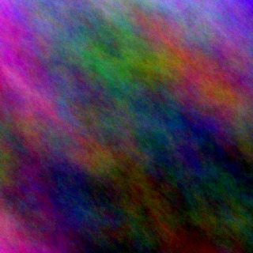
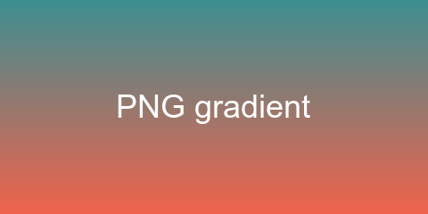
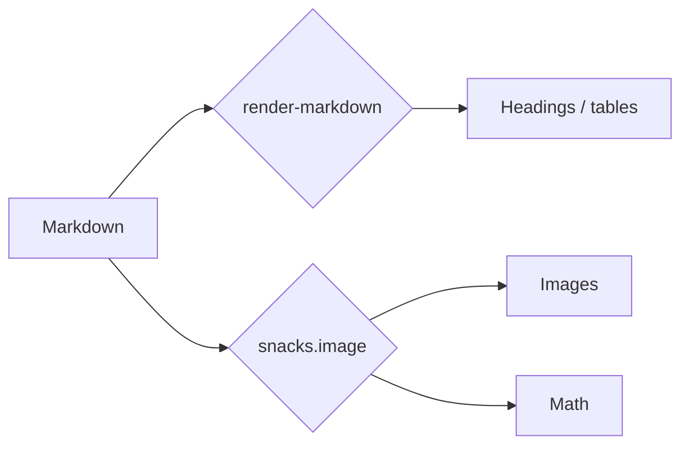

# Heading 1 — Markdown View Test

Testing every element render-markdown can draw. Move the cursor across lines
to check anti-conceal (raw text should show only on the cursor line).

## Heading 2

### Heading 3

#### Heading 4

##### Heading 5

###### Heading 6

Setext Heading 1
================

Setext Heading 2
----------------

# Heading with `inline code` and **bold** and a [link](https://example.com)

## A very long heading that keeps going to see how block-width headings handle text that is wider than the min_width setting

---

## Inline Formatting

Plain paragraph text. **Bold text**, __also bold__, *italic*, _also italic_,
***bold italic***, ~~strikethrough~~, `inline code`, ==highlighted text==,
and a mix: **bold with `code` inside** and *italic with [a link](https://neovim.io)*.

Escaped characters: \*not italic\*, \`not code\`, \# not a heading, \[not a link\].

Line ending with two spaces forces a hard break
this is the next line after the hard break.
Line ending with a backslash also breaks\
like this.

Emoji and unicode: 🚀 ✅ ❌ ⚠️ — “smart quotes” … ∑ ∫ λ → ← ⇒

A really long paragraph to check soft wrapping behavior: Lorem ipsum dolor sit amet, consectetur adipiscing elit, sed do eiusmod tempor incididunt ut labore et dolore magna aliqua. Ut enim ad minim veniam, quis nostrud exercitation ullamco laboris nisi ut aliquip ex ea commodo consequat. Duis aute irure dolor in reprehenderit in voluptate velit esse cillum dolore eu fugiat nulla pariatur.

---

## Links & Images

- Hyperlink: [Neovim](https://neovim.io)
- Link with title: [GitHub](https://github.com "GitHub Homepage")
- GitHub repo link: [render-markdown](https://github.com/MeanderingProgrammer/render-markdown.nvim)
- YouTube link: [video](https://www.youtube.com/watch?v=dQw4w9WgXcQ)
- Reddit link: [r/neovim](https://www.reddit.com/r/neovim)
- Stack Overflow: [question](https://stackoverflow.com/questions/1)
- Autolink: <https://example.com>
- Bare URL: https://example.com/bare
- Email: <someone@example.com>
- Relative file: [init.lua](./init.lua)
- Anchor: [jump to tables](#tables)
- Reference-style: [ref link][ref1] and [another][ref2]
- Wiki link: [[some-note]] and [[some-note|with alias]]
- Image: 
- Image with title: 
<!-- - Image with title:  -->

[ref1](https://example.com/ref1)
[ref1]: https://example.com/ref1
[ref2]: https://example.com/ref2 "Reference two"

Footnotes: here is a claim[^1] and another one[^note].

[^1]: The first footnote.
[^note]: A named footnote with **formatting**.

---

## Images (snacks.image, kitty graphics protocol / Ghostty)

Local assets live in `./markdown_test_assets/`. Each image should render
inline below its link (max 20 rows tall per the snacks.image config), and the
`` text should hide until the cursor is on that line.

PNG (gradient):



JPEG (fractal):


WebP (shapes):


GIF (snacks renders the first frame only; no plugin animates GIFs):


SVG (rasterized with `-background none`, rounded corners should be transparent):


Very wide image (should be scaled to max_width):


Tiny image (60x60):


Path without `./` prefix:


Path with spaces (URL-encoded, then angle-bracket form):


Image with a title:


Remote image (download_remote_images = true, needs network):


Linked image (image wrapped in a link):

[](https://neovim.io)

Reference-style image:

![ref image][img-ref]

[img-ref]: ./markdown_test_assets/shapes.webp

Two images on one line (snacks limitation: each image gets its own block under the line, so they stack/offset; keep images on separate lines):  

HTML image tag (snacks reads  via the html injection):


Broken image (missing file, should fail gracefully):


---

## Lists

### Unordered (nesting levels)

- Level 1 item
- Level 1 item with a longer line of text that should wrap if the window is narrow enough to force it
  - Level 2 item
  - Level 2 item
    - Level 3 item
      - Level 4 item
        - Level 5 item (icons should cycle back)
- Back to level 1

* Asterisk bullet
+ Plus bullet

### Ordered

1. First
2. Second
3. Third
   1. Nested first
   2. Nested second
      1. Deeply nested
10. Jump to ten
11. Eleven

1) Paren-style ordered
2) Second paren item

### Mixed content in list items

1. Item with a paragraph.

   A second paragraph inside the same item.

2. Item with code:

   ```bash
   echo "code inside a list"
   ```

3. Item with a quote:

   > Quote nested in a list item.

4. Item with a nested checklist:
   - [ ] nested unchecked
   - [x] nested checked

---

## Checkboxes

- [ ] Unchecked task
- [x] Checked task (should be struck through in custom variant)
- [X] Checked with capital X
- [-] Todo / in progress (custom state)
- [!] Important (custom state, custom variant only)
- [ ] Task with **bold**, `code` and a [link](https://example.com)
- [ ] Parent task
  - [x] Done subtask
  - [ ] Open subtask

1. [ ] Ordered checkbox
2. [x] Ordered checked

---

## Block Quotes

> A simple single-line quote.

> A multi-line quote that goes on for a while so it wraps across several
> lines in the source file as well.
>
> With a second paragraph and **formatting** and `code`.

> Level 1
> > Level 2
> > > Level 3
> > > > Level 4

> A very long single source line inside a quote to test repeat_linebreak when soft wrap is enabled, it should keep the quote bar on every visual line instead of only the first one.

---

## Callouts (GitHub)

> [!NOTE]
> Useful information that users should know.

> [!TIP]
> Helpful advice for doing things better.

> [!IMPORTANT]
> Key information users need to know.

> [!WARNING]
> Urgent info that needs immediate attention.

> [!CAUTION]
> Advises about risks or negative outcomes.

## Callouts (Obsidian)

> [!ABSTRACT]
> Summary / tldr.

> [!INFO]
> Info callout.

> [!TODO]
> Todo callout.

> [!SUCCESS]
> Done / check.

> [!QUESTION]
> Help / faq.

> [!FAILURE]
> Fail / missing.

> [!DANGER]
> Error.

> [!BUG]
> Bug callout.

> [!EXAMPLE]
> Example callout.

> [!QUOTE]
> Cite callout.

> [!NOTE] Custom title here
> Callout with a custom title.

> [!TIP]- Foldable callout (collapsed marker)
> Body of a foldable callout.

> [!WARNING]
> Callout with a list:
> - item one
> - item two
>
> And `code`.

---

## Code Blocks

```lua
-- Lua
local M = {}

function M.setup(opts)
	opts = vim.tbl_deep_extend("force", { enabled = true }, opts or {})
	return opts
end

return M
```

```python
# Python
from dataclasses import dataclass

@dataclass
class Point:
    x: float
    y: float

    def norm(self) -> float:
        return (self.x ** 2 + self.y ** 2) ** 0.5
```

```zig
const std = @import("std");

pub fn main() !void {
    std.debug.print("hello {s}\n", .{"zig"});
}
```

```rust
fn main() {
    let v: Vec<i32> = (1..=5).map(|x| x * x).collect();
    println!("{:?}", v);
}
```

```c
#include <stdio.h>

int main(void) {
    printf("hello\n");
    return 0;
}
```

```typescript
type User = { id: number; name: string };
const greet = (u: User): string => `hi ${u.name}`;
```

```bash
#!/usr/bin/env bash
for f in *.md; do
  echo "file: $f"
done
```

```json
{
  "name": "test",
  "version": "1.0.0",
  "nested": { "array": [1, 2, 3], "flag": true }
}
```

```yaml
key: value
list:
  - a
  - b
```

```diff
- removed line
+ added line
  unchanged line
```

```sql
SELECT id, name FROM users WHERE active = 1 ORDER BY name;
```

```html
<div class="box"><p>Hello <b>world</b></p></div>
```

```lua title="with info string"
print("code block with extra info after the language")
```

```
Code block with no language specified.
Should still get a background.
```

```unknownlang
Code block with a language that has no icon.
```

```lua
-- A very long line to test code block width with min_width and block width: local really_long_variable_name = some_function_call(argument_one, argument_two, argument_three)
```

~~~python
# Tilde-fenced code block
print("tildes")
~~~

    Indented code block (4 spaces).
    Second line of indented code.

---

## Tables

| Left aligned | Centered | Right aligned |
| :----------- | :------: | ------------: |
| apple        | 1        | 1.00          |
| banana       | 22       | 22.50         |
| cherry       | 333      | 333.75        |

| Feature        | Status | Notes                               |
| -------------- | ------ | ----------------------------------- |
| `inline code`  | ✅     | Code in a cell                      |
| **bold**       | ✅     | Formatting in a cell                |
| [link](#)      | ⚠️     | Concealed link should keep alignment |
| ~~strike~~     | ❌     | Strikethrough in a cell             |

|Compact|Table|No|Padding|
|-|-|-|-|
|a|b|c|d|
|longer cell|x|y|z|

| Single column |
| ------------- |
| one           |
| two           |

| A very wide table | with | many | columns | to | check | how | it | handles | overflow | beyond | the | window | width | in | narrow | splits |
| ----------------- | ---- | ---- | ------- | -- | ----- | --- | -- | ------- | -------- | ------ | --- | ------ | ----- | -- | ------ | ------ |
| 1                 | 2    | 3    | 4       | 5  | 6     | 7   | 8  | 9       | 10       | 11     | 12  | 13     | 14    | 15 | 16     | 17     |

---

## Horizontal Rules

Three dashes:

---

Three asterisks:

***

Three underscores:

___

---

## Math (LaTeX)

Inline math: $E = mc^2$ and $\sum_{i=1}^{n} i = \frac{n(n+1)}{2}$.

Block math:

$$
\int_{-\infty}^{\infty} e^{-x^2} \, dx = \sqrt{\pi}
$$

$$
\begin{aligned}
f(x) &= x^2 + 2x + 1 \\
     &= (x + 1)^2
\end{aligned}
$$

From the render-markdown LaTeX wiki:

$\begin{pmatrix}1\\2\end{pmatrix}$ + $\begin{pmatrix}1\\2\\3\end{pmatrix}$

$\sqrt{3x-1}+(1+x)^2$

$$
\lim_{n\to\infty} \left(1 + \frac{1}{n}\right)^n
$$

Matrix and cases:

$$
A = \begin{bmatrix} a & b \\ c & d \end{bmatrix}, \quad
f(n) = \begin{cases} n/2 & n \text{ even} \\ 3n+1 & n \text{ odd} \end{cases}
$$

Math inside a list:

- Euler: $e^{i\pi} + 1 = 0$
- Gaussian: $\frac{1}{\sigma\sqrt{2\pi}} e^{-\frac{(x-\mu)^2}{2\sigma^2}}$

## Mermaid (snacks.image, needs `mmdc` from @mermaid-js/mermaid-cli)



---

## HTML

<!-- An HTML comment that should be concealed or dimmed -->

<details>
<summary>Click to expand</summary>

Hidden content inside a details block.

</details>

Inline HTML: <kbd>Ctrl</kbd> + <kbd>C</kbd>, H<sub>2</sub>O, x<sup>2</sup>, <mark>marked</mark>.

<div align="center">
  <b>Centered HTML block</b>
</div>

---

## Edge Cases

#No space after hash (not a heading)

####### Seven hashes (not a heading)

-Not a list (no space)

>

> Quote above is empty.

-

Empty list item above.

**Unclosed bold

`unclosed code

A line with trailing whitespace

Tab	separated	text	here.

Deeply nested everything:

- > Quote in list
  > - [ ] checkbox in quote in list
  >   ```lua
  >   print("code in checkbox in quote in list")
  >   ```

---

# Final Heading 1

## Final Heading 2

The end. If everything above looks good, the config is solid.
